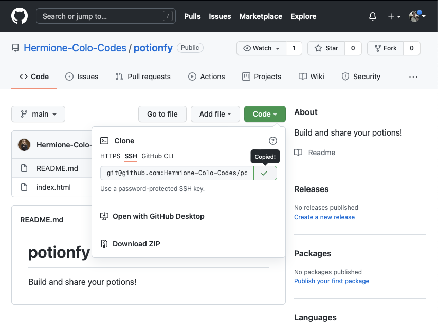

# UN Datathon Note  <!-- omit in toc -->

**Table of Contents:**
- [Using Git](#using-git)
  - [Working On A Repository](#working-on-a-repository)

**Important links:**
- https://unstats.un.org/wiki/display/UNDatathon2023/Getting+Started+with+UN+Datathon+2023
- https://discord.gg/2RX48akAaB

## Using Git
1. Make sure you are a collaborator inside a Git Repo.
2. You can create, add or delete file on GitHub where you do so via online. Now, let's talk about how to do that in you local development environment, that is your PC or laptop
3. First, copy the SSH key from GitHub as follows:
   


1. Create any empty folder and open that folder on VS Code and run:
   
```bash
git clone git@github.com:Hermione-Colo-Codes/potionfy.git
```

### Working On A Repository
1. Create a branch for you to work with, then switch to this new branch
```bash
git branch branch_name
git checkout branch_name
```
2. Check the changes you made
```bash
git status
```
3. Stage the changes that you made
```bash
git add .
git commit -m "message to add #1"
git status
```
4. Push the change to GitHub
```bash
git push
```
